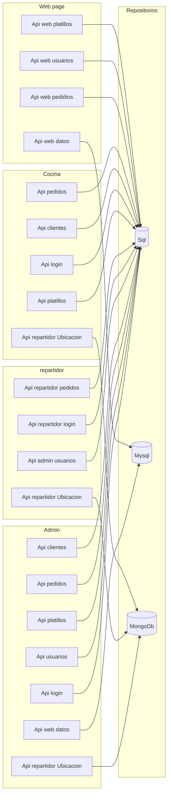

# EntregasADomicilio MicroServicios

## Diagrama del sistema

```mermaid
flowchart LR
    subgraph Repositorios
        Db[(Sql)]
        DbMysql[(Mysql)] 
        DbMongo[(MongoDb)]
    end

    subgraph Web page
        C[Api web datos] -->DbMysql
        A[Api web platillos] -->Db
        B[Api web usuarios] --> Db
        D[Api web pedidios] --> Db
    end
    


    subgraph Cocina
        H[Api pedidos] -->Db
        I[Api clientes] -->Db
        J[Api login] -->Db
        K[Api platillos] -->Db
        L[Api repartidor Ubicacion] --> DbMongo
    end

    subgraph repartidor
        G[Api repartidor Ubicacion] --> DbMongo
        E[Api repartidor pedidos] --> Db
        F[Api repartidor login] --> Db
        H1[Api admin usuarios] --> Db
    end

    subgraph Admin
        M[Api web datos] --> DbMysql
        N[Api clientes] --> Db
        O[Api pedidos] --> Db
        P[Api platillos] --> Db
        Q[Api repartidor Ubicacion] --> DbMongo
        R[Api usuarios] --> Db
        S[Api login] --> Db
    end
```
