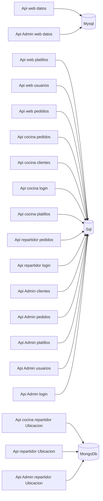
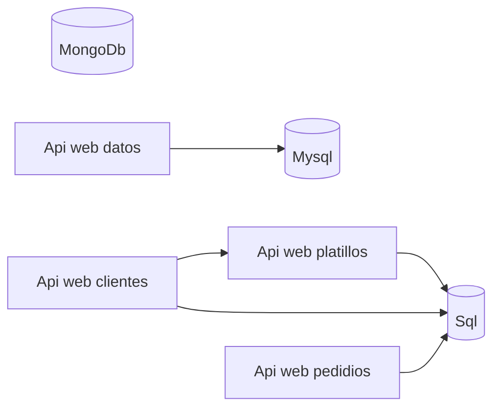

# EntregasADomicilio MicroServicios

## Diagrama del sistema

## Web

## Bitacora

Ya tengo públicado localmente en el IIS el componente de pedidos y platillos

Hay que programar jenkins para que 
Proceso IIS
1.- verifique el repositorio 
2.- publique localmente en el IIS
3.- Corra pruebas 
4.- De el reporte de las pruebas

Proceso Docker
1.- verifique el repositorio 
2.- despliegue en el Docker
3.- Corra pruebas 
4.- De el reporte de las pruebas

Proceso Web
1.- verifique el repositorio 
2.- despliegue en mi sitio web en subduminios
3.- Corra pruebas 
4.- De el reporte de las pruebas